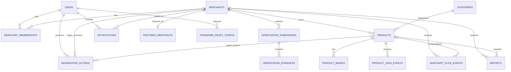

# DATABASE DESIGN
## Sungairujing Marketplace

**Version:** 1.0  
**Status:** Database Design Baseline  
**Project:** Sungairujing Marketplace  
**Database:** PostgreSQL  
**Related Documents:** `PRD.md`, `BUSINESS-RULES.md`, `USER-FLOW.md`  
**Scope:** MVP  

---

# 1. Purpose

Dokumen ini mendefinisikan rancangan database Sungairujing Marketplace berdasarkan requirement dan business rules yang sudah disepakati.

Database harus mendukung:

- autentikasi Admin Merchant dan Super Admin;
- merchant multi-tenant;
- kesiapan multi-admin merchant di masa depan;
- profil merchant;
- verifikasi merchant;
- bukti usaha privat;
- kategori global;
- produk;
- maksimal 5 gambar per produk;
- cart berbasis browser tanpa database order;
- product views;
- WhatsApp click analytics;
- report produk dan merchant;
- moderation/suspension;
- banner/promo;
- featured merchants;
- notifikasi internal;
- password recovery melalui WhatsApp jika provider tersedia.

Database **tidak boleh membuat entity order, payment, transaction, buyer account, wishlist, rating, atau review** pada MVP.

---

# 2. Design Principles

## 2.1 PostgreSQL First

Rancangan mengikuti kemampuan PostgreSQL dan tidak bergantung pada ORM tertentu.

ORM akan dipilih pada `TECHNICAL-SPEC.md`.

---

## 2.2 UUID Primary Keys

Direkomendasikan menggunakan UUID untuk primary key.

Contoh:

```text
id UUID PRIMARY KEY
```

Keuntungan:

- tidak mengekspos urutan record;
- aman digunakan pada sistem distributed/deployment;
- memudahkan future integration;
- tidak bergantung pada auto-increment integer.

---

## 2.3 Server-side Ownership

Semua data milik merchant wajib dapat di-scope menggunakan `merchant_id`.

Contoh:

```text
products.merchant_id
verification_submissions.merchant_id
whatsapp_click_events.merchant_id
```

Ini memungkinkan authorization:

```text
authenticated merchant
        ↓
membership
        ↓
merchant_id
        ↓
resource ownership
```

---

## 2.4 No Order Table

Tidak dibuat:

```text
orders
order_items
payments
transactions
shipping
```

Checkout WhatsApp bukan transaksi internal.

---

## 2.5 Preserve Business Truth

Analytics hanya menyimpan interaction yang benar-benar diketahui aplikasi:

```text
Product View
WhatsApp Click
```

Tidak ada kolom:

```text
sales_count
order_count
revenue
```

---

## 2.6 Private File Metadata

Database hanya menyimpan metadata dan storage key file.

Bukti usaha harus disimpan pada private object storage, bukan sebagai public URL permanen.

---

# 3. High-Level Entity List

Core entities:

```text
users
merchants
merchant_memberships

verification_submissions
verification_evidences

categories

products
product_images

product_view_events
whatsapp_click_events

reports

notifications

banners
featured_merchants

password_reset_tokens
```

Optional internal audit entity yang direkomendasikan:

```text
moderation_actions
```

`moderation_actions` tetap termasuk baseline karena membantu mempertahankan riwayat tindakan suspend/reactivate dan alasan administrasi.

---

# 4. High-Level ERD



---

# 5. Enum Definitions

Nama enum final dapat disesuaikan ORM, tetapi nilai bisnis tidak boleh berubah tanpa requirement update.

---

## 5.1 Global User Role

```text
USER
SUPER_ADMIN
```

Merchant authorization tidak hanya bergantung pada role `USER`, tetapi pada `merchant_memberships`.

---

## 5.2 Merchant Membership Role

```text
OWNER
ADMIN
```

MVP hanya membutuhkan satu `OWNER`.

`ADMIN` disediakan untuk kesiapan multi-admin di masa depan.

---

## 5.3 Merchant Status

```text
ACTIVE
SUSPENDED
```

---

## 5.4 Merchant Operational Status

```text
BUKA
TUTUP
LIBUR_SEMENTARA
```

---

## 5.5 Merchant Verification Status

Public/business status:

```text
BELUM_DIVERIFIKASI
TERVERIFIKASI
DITOLAK
```

---

## 5.6 Verification Submission Status

Internal workflow:

```text
PENDING
APPROVED
REJECTED
```

`PENDING` adalah status submission internal dan tidak mengubah daftar status bisnis publik.

Ketika merchant mengajukan ulang setelah ditolak:

```text
merchant.verification_status
→ BELUM_DIVERIFIKASI

new verification_submission
→ PENDING
```

---

## 5.7 Product Availability

```text
TERSEDIA
HABIS
```

---

## 5.8 Product Moderation Status

```text
ACTIVE
SUSPENDED
```

---

## 5.9 WhatsApp Click Source

```text
PRODUCT_DETAIL
MERCHANT_PROFILE
CHECKOUT
```

---

## 5.10 Report Target Type

```text
PRODUCT
MERCHANT
```

---

## 5.11 Report Reason

```text
ILLEGAL_OR_PROHIBITED
DANGEROUS_PRODUCT
FRAUD_OR_MISLEADING
PHOTO_DESCRIPTION_MISMATCH
SPAM
OTHER
```

---

## 5.12 Report Status

```text
BARU
DITINJAU
SELESAI
DITOLAK
```

---

## 5.13 Notification Type

Baseline:

```text
VERIFICATION_APPROVED
VERIFICATION_REJECTED
PRODUCT_SUSPENDED
MERCHANT_SUSPENDED
MERCHANT_REACTIVATED
```

---

## 5.14 Moderation Action Type

```text
PRODUCT_SUSPENDED
PRODUCT_UNSUSPENDED
MERCHANT_SUSPENDED
MERCHANT_REACTIVATED
PRODUCT_DELETED
MERCHANT_DELETED
```

---

# 6. Table: users

Menyimpan akun yang dapat login.

```text
users
```

## Columns

| Column | Type | Constraint | Description |
|---|---|---|---|
| id | UUID | PK | User identifier |
| whatsapp_number | VARCHAR | NOT NULL, UNIQUE | Login identifier |
| password_hash | TEXT | NOT NULL | Secure password hash |
| global_role | ENUM | NOT NULL | USER / SUPER_ADMIN |
| terms_accepted_at | TIMESTAMPTZ | NULL | Waktu menyetujui terms |
| terms_version | VARCHAR | NULL | Versi terms yang diterima |
| is_active | BOOLEAN | NOT NULL DEFAULT TRUE | Status akun login |
| last_login_at | TIMESTAMPTZ | NULL | Login terakhir |
| created_at | TIMESTAMPTZ | NOT NULL | Created timestamp |
| updated_at | TIMESTAMPTZ | NOT NULL | Updated timestamp |

## Constraints

```text
UNIQUE(whatsapp_number)
```

Nomor harus dinormalisasi sebelum disimpan.

Contoh canonical representation:

```text
6281234567890
```

bukan menyimpan campuran:

```text
081234567890
+6281234567890
62 812-3456-7890
```

---

# 7. Table: merchants

Menyimpan profil bisnis publik dan status merchant.

```text
merchants
```

## Columns

| Column | Type | Constraint | Description |
|---|---|---|---|
| id | UUID | PK | Merchant identifier |
| name | VARCHAR | NOT NULL | Nama merchant |
| slug | VARCHAR | NOT NULL, UNIQUE | Public slug |
| description | TEXT | NULL | Deskripsi merchant |
| logo_storage_key | TEXT | NULL | Lokasi logo |
| address | TEXT | NOT NULL | Alamat merchant |
| public_whatsapp_number | VARCHAR | NOT NULL | Nomor WhatsApp publik |
| opening_hours | JSONB | NULL | Jam operasional |
| operational_status | ENUM | NOT NULL | BUKA/TUTUP/LIBUR_SEMENTARA |
| status | ENUM | NOT NULL DEFAULT ACTIVE | ACTIVE/SUSPENDED |
| verification_status | ENUM | NOT NULL | Status verifikasi |
| suspension_reason | TEXT | NULL | Current suspension reason |
| suspended_at | TIMESTAMPTZ | NULL | Waktu suspension |
| suspended_by_user_id | UUID | FK users, NULL | Admin yang suspend |
| created_at | TIMESTAMPTZ | NOT NULL | Created timestamp |
| updated_at | TIMESTAMPTZ | NOT NULL | Updated timestamp |

## Notes

`public_whatsapp_number` dipisahkan dari `users.whatsapp_number` agar model tetap siap untuk multi-admin di masa depan.

Untuk MVP:

```text
primary owner login WhatsApp
=
merchant public WhatsApp
```

saat registrasi.

Perubahan nomor utama dilakukan melalui Super Admin dan harus dijalankan dalam transaksi aplikasi agar data akun dan kontak merchant tetap konsisten sesuai business rule MVP.

---

# 8. Table: merchant_memberships

Menghubungkan account dengan merchant.

```text
merchant_memberships
```

## Columns

| Column | Type | Constraint |
|---|---|---|
| id | UUID | PK |
| merchant_id | UUID | FK merchants, NOT NULL |
| user_id | UUID | FK users, NOT NULL |
| role | ENUM | NOT NULL |
| is_active | BOOLEAN | NOT NULL DEFAULT TRUE |
| created_at | TIMESTAMPTZ | NOT NULL |
| updated_at | TIMESTAMPTZ | NOT NULL |

## Constraints

```text
UNIQUE(merchant_id, user_id)
```

Untuk MVP, aplikasi harus menjaga:

```text
maximum 1 active OWNER per merchant
```

Direkomendasikan menggunakan partial unique index PostgreSQL:

```sql
CREATE UNIQUE INDEX uq_active_owner_per_merchant
ON merchant_memberships (merchant_id)
WHERE role = 'OWNER' AND is_active = true;
```

---

# 9. Authentication Relationship

Authorization merchant:

```text
users
   ↓
merchant_memberships
   ↓
merchants
   ↓
merchant-owned resources
```

Contoh authorization product:

```text
authenticated user
→ find active membership
→ obtain merchant_id
→ product.merchant_id must match
```

Super Admin tidak membutuhkan membership untuk mengakses resource administratif.

---

# 10. Table: verification_submissions

Menyimpan setiap pengajuan verifikasi merchant.

```text
verification_submissions
```

## Columns

| Column | Type | Constraint |
|---|---|---|
| id | UUID | PK |
| merchant_id | UUID | FK merchants, NOT NULL |
| status | ENUM | NOT NULL |
| submitted_at | TIMESTAMPTZ | NOT NULL |
| reviewed_at | TIMESTAMPTZ | NULL |
| reviewed_by_user_id | UUID | FK users, NULL |
| rejection_reason | TEXT | NULL |
| created_at | TIMESTAMPTZ | NOT NULL |
| updated_at | TIMESTAMPTZ | NOT NULL |

## Rules

Ketika submission dibuat:

```text
submission.status = PENDING
merchant.verification_status = BELUM_DIVERIFIKASI
```

Ketika disetujui:

```text
submission.status = APPROVED
merchant.verification_status = TERVERIFIKASI
```

Ketika ditolak:

```text
submission.status = REJECTED
merchant.verification_status = DITOLAK
```

---

# 11. Table: verification_evidences

Metadata file bukti usaha privat.

```text
verification_evidences
```

## Columns

| Column | Type | Constraint |
|---|---|---|
| id | UUID | PK |
| submission_id | UUID | FK verification_submissions, NOT NULL |
| storage_key | TEXT | NOT NULL |
| original_filename | TEXT | NOT NULL |
| mime_type | VARCHAR | NOT NULL |
| size_bytes | BIGINT | NOT NULL |
| created_at | TIMESTAMPTZ | NOT NULL |

## Rules

Maximum:

```text
3 evidence files / submission
```

Limit 3 file lebih mudah ditegakkan pada application/service layer dalam satu transaction.

Storage harus private.

Database tidak menyimpan public permanent URL.

---

# 12. Table: categories

Kategori produk global.

```text
categories
```

## Columns

| Column | Type | Constraint |
|---|---|---|
| id | UUID | PK |
| name | VARCHAR | NOT NULL |
| slug | VARCHAR | NOT NULL, UNIQUE |
| description | TEXT | NULL |
| is_active | BOOLEAN | NOT NULL DEFAULT TRUE |
| sort_order | INTEGER | NULL |
| created_at | TIMESTAMPTZ | NOT NULL |
| updated_at | TIMESTAMPTZ | NOT NULL |

## Recommended Constraint

Case-insensitive duplicate category perlu dicegah di application layer atau dengan normalized field/index.

Contoh:

```text
Makanan
makanan
MAKANAN
```

tidak boleh menjadi tiga kategori berbeda.

---

# 13. Category Deletion Strategy

Strategi baseline:

```text
Soft Disable First
+
RESTRICT Hard Delete When Referenced
```

Jika kategori memiliki produk:

```text
do not hard delete
→ set is_active = false
```

Kategori inactive:

- tidak tersedia untuk produk baru;
- relasi produk lama tidak rusak.

Hard delete hanya aman ketika kategori tidak direferensikan produk.

---

# 14. Table: products

Menyimpan produk merchant.

```text
products
```

## Columns

| Column | Type | Constraint |
|---|---|---|
| id | UUID | PK |
| merchant_id | UUID | FK merchants, NOT NULL |
| category_id | UUID | FK categories, NOT NULL |
| name | VARCHAR | NOT NULL |
| slug | VARCHAR | NOT NULL, UNIQUE |
| description | TEXT | NOT NULL |
| price | NUMERIC(14,2) | NOT NULL |
| unit | VARCHAR | NOT NULL |
| availability_status | ENUM | NOT NULL |
| moderation_status | ENUM | NOT NULL DEFAULT ACTIVE |
| suspension_reason | TEXT | NULL |
| suspended_at | TIMESTAMPTZ | NULL |
| suspended_by_user_id | UUID | FK users, NULL |
| created_at | TIMESTAMPTZ | NOT NULL |
| updated_at | TIMESTAMPTZ | NOT NULL |

## Constraints

```text
price >= 0
```

Tidak ada:

```text
stock_quantity
order_count
sold_count
rating
variant_id
```

---

# 15. Product Slug Strategy

Baseline public route:

```text
/products/{slug}
```

Maka `products.slug` dibuat global unique.

Contoh slug:

```text
koncok-koncok-dapur-bawean
```

Slug generator harus menangani duplicate secara deterministic.

---

# 16. Table: product_images

```text
product_images
```

## Columns

| Column | Type | Constraint |
|---|---|---|
| id | UUID | PK |
| product_id | UUID | FK products, NOT NULL |
| storage_key | TEXT | NOT NULL |
| alt_text | VARCHAR | NULL |
| sort_order | INTEGER | NOT NULL DEFAULT 0 |
| is_cover | BOOLEAN | NOT NULL DEFAULT FALSE |
| mime_type | VARCHAR | NOT NULL |
| size_bytes | BIGINT | NOT NULL |
| width | INTEGER | NULL |
| height | INTEGER | NULL |
| created_at | TIMESTAMPTZ | NOT NULL |

## Rules

Maximum:

```text
5 images / product
```

Hanya satu cover aktif.

Recommended partial unique index:

```sql
CREATE UNIQUE INDEX uq_product_cover
ON product_images (product_id)
WHERE is_cover = true;
```

Maximum 5 tetap ditegakkan application/service layer.

---

# 17. Product Public Eligibility

Product dianggap public eligible jika:

```text
products.moderation_status = ACTIVE
AND
merchants.status = ACTIVE
```

`availability_status = HABIS` tidak membuat produk hilang.

Merchant verification juga bukan syarat visibility.

---

# 18. No Cart Table

Cart tidak disimpan pada PostgreSQL.

Cart disimpan di client/browser storage.

Struktur konseptual:

```json
{
  "merchantId": "...",
  "items": [
    {
      "productId": "...",
      "quantity": 2
    }
  ]
}
```

Harga, nama, merchant, dan availability **harus divalidasi ulang dari server sebelum checkout**.

Client snapshot tidak dianggap authoritative.

---

# 19. No Checkout / Order Table

Tidak dibuat database entity untuk:

```text
checkout
order
order_item
payment
shipment
```

Reference code `SRM-...` dapat dibuat saat runtime.

Reference code tidak wajib disimpan karena tidak merepresentasikan transaksi internal.

---

# 20. Table: product_view_events

Menyimpan view yang **lolos aturan dedupe**.

```text
product_view_events
```

## Columns

| Column | Type | Constraint |
|---|---|---|
| id | UUID | PK |
| product_id | UUID | FK products, NOT NULL |
| merchant_id | UUID | FK merchants, NOT NULL |
| visitor_key_hash | VARCHAR | NOT NULL |
| counted_at | TIMESTAMPTZ | NOT NULL |
| created_at | TIMESTAMPTZ | NOT NULL |

## Important Privacy Rule

Jangan menyimpan fingerprint agresif atau data pribadi yang tidak diperlukan.

`visitor_key_hash` sebaiknya berasal dari random browser identifier yang disimpan di local storage/cookie dan di-hash server-side.

---

# 21. Product View Deduplication

Business rule:

```text
1 browser
+ 1 product
+ 24 hours
= maximum 1 counted view
```

Flow:

```text
request product detail
→ read visitor key
→ query latest event for product + visitor
→ if last counted_at < now - 24h
     insert event
  else
     do not insert
```

Recommended index:

```sql
CREATE INDEX idx_product_view_dedupe
ON product_view_events
(product_id, visitor_key_hash, counted_at DESC);
```

Recommended popularity index:

```sql
CREATE INDEX idx_product_views_product_time
ON product_view_events
(product_id, counted_at DESC);
```

Untuk MVP scale, event table cukup dan belum memerlukan materialized aggregate.

---

# 22. Product Popularity Query

Conceptual query:

```sql
SELECT product_id, COUNT(*) AS views
FROM product_view_events
GROUP BY product_id
ORDER BY views DESC
LIMIT 8;
```

Query real harus join/filter:

```text
product ACTIVE
merchant ACTIVE
```

agar suspended resource tidak tampil.

---

# 23. Table: whatsapp_click_events

Menyimpan interaction WhatsApp.

```text
whatsapp_click_events
```

## Columns

| Column | Type | Constraint |
|---|---|---|
| id | UUID | PK |
| merchant_id | UUID | FK merchants, NOT NULL |
| product_id | UUID | FK products, NULL |
| source | ENUM | NOT NULL |
| visitor_key_hash | VARCHAR | NULL |
| clicked_at | TIMESTAMPTZ | NOT NULL |
| created_at | TIMESTAMPTZ | NOT NULL |

## Source Rules

### PRODUCT_DETAIL

```text
merchant_id required
product_id required
```

### MERCHANT_PROFILE

```text
merchant_id required
product_id null
```

### CHECKOUT

```text
merchant_id required
product_id may be null
```

Checkout dapat memiliki banyak produk, sehingga event tidak perlu dipaksa menunjuk satu product.

---

# 24. WhatsApp Analytics Indexes

Recommended:

```sql
CREATE INDEX idx_whatsapp_click_merchant_time
ON whatsapp_click_events
(merchant_id, clicked_at DESC);
```

```sql
CREATE INDEX idx_whatsapp_click_product_time
ON whatsapp_click_events
(product_id, clicked_at DESC)
WHERE product_id IS NOT NULL;
```

```sql
CREATE INDEX idx_whatsapp_click_source_time
ON whatsapp_click_events
(source, clicked_at DESC);
```

---

# 25. Merchant Analytics Query Scope

Merchant dashboard hanya boleh query:

```text
WHERE merchant_id = authenticated_merchant_id
```

Time ranges:

```text
TODAY
LAST_7_DAYS
LAST_30_DAYS
ALL_TIME
```

Tidak ada revenue/sales query.

---

# 26. Table: reports

Menyimpan laporan publik.

```text
reports
```

## Columns

| Column | Type | Constraint |
|---|---|---|
| id | UUID | PK |
| target_type | ENUM | NOT NULL |
| reported_product_id | UUID | FK products, NULL |
| reported_merchant_id | UUID | FK merchants, NULL |
| target_name_snapshot | VARCHAR | NOT NULL |
| reason | ENUM | NOT NULL |
| details | TEXT | NULL |
| reporter_name | VARCHAR | NULL |
| reporter_whatsapp | VARCHAR | NULL |
| status | ENUM | NOT NULL DEFAULT BARU |
| reviewed_by_user_id | UUID | FK users, NULL |
| reviewed_at | TIMESTAMPTZ | NULL |
| resolution_note | TEXT | NULL |
| created_at | TIMESTAMPTZ | NOT NULL |
| updated_at | TIMESTAMPTZ | NOT NULL |

---

# 27. Report Target Rules

Saat report dibuat:

### PRODUCT

```text
target_type = PRODUCT
reported_product_id = product.id
reported_merchant_id = product.merchant_id
target_name_snapshot = product.name
```

### MERCHANT

```text
target_type = MERCHANT
reported_product_id = null
reported_merchant_id = merchant.id
target_name_snapshot = merchant.name
```

`target_name_snapshot` mempertahankan konteks report jika target kemudian dihapus permanen.

---

# 28. Report OTHER Rule

Jika:

```text
reason = OTHER
```

maka:

```text
details IS REQUIRED
```

Pengecekan dapat dilakukan pada service/application validation.

---

# 29. Report Retention on Deletion

Recommended:

```text
reported_product_id
ON DELETE SET NULL

reported_merchant_id
ON DELETE SET NULL
```

Report tetap tersimpan sebagai riwayat moderation dengan:

```text
target_type
target_name_snapshot
reason
details
timestamps
```

Ini mencegah report history hilang hanya karena target dihapus.

---

# 30. Table: moderation_actions

Riwayat tindakan administratif.

```text
moderation_actions
```

## Columns

| Column | Type | Constraint |
|---|---|---|
| id | UUID | PK |
| action_type | ENUM | NOT NULL |
| actor_user_id | UUID | FK users, NOT NULL |
| merchant_id | UUID | FK merchants, NULL |
| product_id | UUID | FK products, NULL |
| target_name_snapshot | VARCHAR | NOT NULL |
| reason | TEXT | NULL |
| created_at | TIMESTAMPTZ | NOT NULL |

## Purpose

Menjaga riwayat:

```text
who
did what
to which resource
when
why
```

tanpa membuat UI audit log sebagai fitur publik.

---

# 31. Merchant Suspension Transaction

Ketika Super Admin suspend merchant:

```text
BEGIN

UPDATE merchants
SET status = SUSPENDED,
    suspension_reason = ...,
    suspended_at = now(),
    suspended_by_user_id = admin_id

INSERT moderation_actions(... MERCHANT_SUSPENDED ...)

INSERT notification(... MERCHANT_SUSPENDED ...)

COMMIT
```

Produk tidak perlu diubah satu per satu menjadi suspended.

Public eligibility cukup memeriksa:

```text
merchant.status = ACTIVE
AND
product.moderation_status = ACTIVE
```

Ini membuat reactivation lebih aman.

---

# 32. Product Suspension Transaction

```text
BEGIN

UPDATE products
SET moderation_status = SUSPENDED,
    suspension_reason = ...,
    suspended_at = now(),
    suspended_by_user_id = admin_id

INSERT moderation_actions(... PRODUCT_SUSPENDED ...)

INSERT notification(... PRODUCT_SUSPENDED ...)

COMMIT
```

---

# 33. Table: notifications

Notifikasi internal dashboard.

```text
notifications
```

## Columns

| Column | Type | Constraint |
|---|---|---|
| id | UUID | PK |
| recipient_user_id | UUID | FK users, NOT NULL |
| merchant_id | UUID | FK merchants, NULL |
| type | ENUM | NOT NULL |
| title | VARCHAR | NOT NULL |
| message | TEXT | NOT NULL |
| related_product_id | UUID | FK products, NULL |
| read_at | TIMESTAMPTZ | NULL |
| created_at | TIMESTAMPTZ | NOT NULL |

## Notes

MVP satu merchant memiliki satu primary admin, sehingga notification langsung ke `recipient_user_id`.

Ketika multi-admin diterapkan di masa depan, service dapat membuat notification untuk setiap anggota merchant yang relevan.

---

# 34. Notification Index

Recommended:

```sql
CREATE INDEX idx_notifications_user_unread
ON notifications
(recipient_user_id, read_at, created_at DESC);
```

---

# 35. Table: banners

```text
banners
```

## Columns

| Column | Type | Constraint |
|---|---|---|
| id | UUID | PK |
| title | VARCHAR | NOT NULL |
| description | TEXT | NULL |
| image_storage_key | TEXT | NOT NULL |
| cta_text | VARCHAR | NULL |
| target_url | TEXT | NULL |
| start_at | TIMESTAMPTZ | NULL |
| end_at | TIMESTAMPTZ | NULL |
| is_active | BOOLEAN | NOT NULL DEFAULT FALSE |
| created_by_user_id | UUID | FK users, NOT NULL |
| created_at | TIMESTAMPTZ | NOT NULL |
| updated_at | TIMESTAMPTZ | NOT NULL |

## Date Constraint

Jika keduanya tersedia:

```text
end_at >= start_at
```

---

# 36. Banner Visibility

Eligible:

```text
is_active = true
AND
(start_at IS NULL OR start_at <= now())
AND
(end_at IS NULL OR end_at >= now())
```

Dengan model ini, tanggal dapat opsional.

Contoh:

- tanpa start date → aktif segera;
- tanpa end date → aktif sampai dinonaktifkan.

---

# 37. Table: featured_merchants

Menyimpan merchant pilihan homepage.

```text
featured_merchants
```

## Columns

| Column | Type | Constraint |
|---|---|---|
| id | UUID | PK |
| merchant_id | UUID | FK merchants, NOT NULL, UNIQUE |
| sort_order | SMALLINT | NOT NULL |
| created_by_user_id | UUID | FK users, NOT NULL |
| created_at | TIMESTAMPTZ | NOT NULL |

## Constraints

```text
sort_order BETWEEN 1 AND 5
UNIQUE(sort_order)
UNIQUE(merchant_id)
```

Dengan posisi unik 1–5, tabel secara natural memiliki maksimal 5 featured merchant.

Merchant suspended tetap boleh secara teknis berada di tabel, tetapi public query wajib memfilter merchant `ACTIVE`.

---

# 38. Table: password_reset_tokens

Disiapkan untuk recovery WhatsApp.

```text
password_reset_tokens
```

## Columns

| Column | Type | Constraint |
|---|---|---|
| id | UUID | PK |
| user_id | UUID | FK users, NOT NULL |
| token_hash | TEXT | NOT NULL, UNIQUE |
| expires_at | TIMESTAMPTZ | NOT NULL |
| used_at | TIMESTAMPTZ | NULL |
| created_at | TIMESTAMPTZ | NOT NULL |

## Security

Database tidak menyimpan raw reset token.

Yang disimpan:

```text
HASH(token)
```

Provider WhatsApp mengirim recovery link/code yang terkait dengan token raw sementara.

---

# 39. Password Reset Validity

Token valid jika:

```text
used_at IS NULL
AND
expires_at > now()
```

Setelah password berhasil diubah:

```text
used_at = now()
```

Direkomendasikan invalidasi token lain yang masih aktif untuk user yang sama.

---

# 40. Opening Hours JSON Structure

Untuk MVP, `opening_hours` dapat menggunakan JSONB agar fleksibel.

Contoh:

```json
{
  "senin": {
    "open": "08:00",
    "close": "17:00",
    "closed": false
  },
  "selasa": {
    "open": "08:00",
    "close": "17:00",
    "closed": false
  },
  "minggu": {
    "closed": true
  }
}
```

Operational status tetap terpisah:

```text
BUKA
TUTUP
LIBUR_SEMENTARA
```

karena merchant harus dapat melakukan override sementara tanpa mengubah seluruh jadwal.

---

# 41. Timestamp Standard

Gunakan:

```text
TIMESTAMPTZ
```

untuk waktu yang memiliki makna temporal.

Simpan waktu dalam representasi timezone-aware.

Formatting waktu Indonesia dilakukan pada application/UI layer.

---

# 42. Money Type

Harga menggunakan:

```text
NUMERIC(14,2)
```

bukan floating point.

Contoh:

```text
40000.00
```

Jangan menggunakan:

```text
FLOAT
DOUBLE
```

untuk nilai uang.

---

# 43. WhatsApp Number Normalization

Sebelum persist:

```text
trim spaces
remove non-essential separators
normalize country code
```

Canonical recommendation Indonesia:

```text
628xxxxxxxxxx
```

Display dapat diformat berbeda pada UI.

---

# 44. Slug Rules

Slug:

- lowercase;
- URL-safe;
- unique sesuai tabel;
- generated dari nama;
- duplicate diberi suffix.

Contoh:

```text
Dapur Bawean
→ dapur-bawean
```

Duplicate:

```text
dapur-bawean
dapur-bawean-2
```

---

# 45. Foreign Key Strategy

Baseline:

| Parent | Child | Delete Behavior |
|---|---|---|
| merchants | merchant_memberships | CASCADE |
| merchants | verification_submissions | CASCADE |
| verification_submissions | verification_evidences | CASCADE |
| merchants | products | CASCADE |
| categories | products | RESTRICT |
| products | product_images | CASCADE |
| products | product_view_events | CASCADE |
| merchants | product_view_events | CASCADE |
| merchants | whatsapp_click_events | CASCADE |
| products | whatsapp_click_events | SET NULL |
| products | reports | SET NULL |
| merchants | reports | SET NULL |
| merchants | featured_merchants | CASCADE |
| users | password_reset_tokens | CASCADE |
| users | notifications | CASCADE |

---

# 46. Merchant Permanent Deletion Policy

Merchant permanent deletion adalah destructive operation.

Recommended transaction:

```text
1. Confirm Super Admin authorization
2. Create moderation/audit snapshot if needed
3. Delete object storage files
4. Delete merchant row
5. Database cascades dependent merchant data
6. Reports retain snapshots with FK set null
7. Delete orphan merchant user only if safe
```

Karena architecture future-ready multi-admin, `users` tidak boleh otomatis cascade dari merchant.

Setelah merchant dihapus:

```text
IF user is not SUPER_ADMIN
AND user has no remaining merchant membership
THEN application may delete/disable that user
```

---

# 47. Product Permanent Deletion Policy

Ketika merchant menghapus produk:

```text
products row
→ DELETE
```

Cascade:

```text
product_images
product_view_events
```

Set null/preserve:

```text
whatsapp_click_events.product_id
reports.reported_product_id
```

`target_name_snapshot` pada report/moderation history mempertahankan konteks.

---

# 48. Object Storage Cleanup

Database deletion dan object storage deletion harus dirancang agar tidak menghasilkan orphan files.

Resource file:

```text
merchant logo
product images
verification evidence
banner image
```

Technical Specification harus menentukan cleanup strategy.

Recommended:

```text
database transaction
+
post-commit storage cleanup job/service
```

atau mekanisme compensating action apabila upload/delete gagal.

---

# 49. Index Strategy

Minimal recommended indexes:

```text
users.whatsapp_number UNIQUE
merchants.slug UNIQUE
products.slug UNIQUE
categories.slug UNIQUE

merchant_memberships(user_id, is_active)
merchant_memberships(merchant_id, is_active)

products(merchant_id, created_at)
products(category_id, created_at)
products(moderation_status, created_at)
products(availability_status, created_at)

product_view_events(product_id, counted_at)
product_view_events(product_id, visitor_key_hash, counted_at)

whatsapp_click_events(merchant_id, clicked_at)
whatsapp_click_events(source, clicked_at)

reports(status, created_at)
reports(reported_merchant_id, created_at)
reports(reported_product_id, created_at)

verification_submissions(merchant_id, submitted_at)
verification_submissions(status, submitted_at)

notifications(recipient_user_id, read_at, created_at)

banners(is_active, start_at, end_at)
```

---

# 50. Search Strategy

MVP dapat memulai dengan PostgreSQL search sederhana.

Searchable fields:

```text
products.name
products.description
merchants.name
merchants.description
```

Pilihan implementasi ditentukan Technical Specification:

```text
ILIKE
OR
PostgreSQL Full Text Search
```

Tidak perlu search service eksternal untuk MVP kecuali scale berubah.

---

# 51. Price Filter

Query baseline:

```text
WHERE price >= min_price
AND price <= max_price
```

Price range tidak membutuhkan tabel tambahan.

---

# 52. Product Sorting

### Newest

```sql
ORDER BY created_at DESC
```

### Lowest Price

```sql
ORDER BY price ASC
```

### Highest Price

```sql
ORDER BY price DESC
```

Public query tetap harus menerapkan eligibility merchant/product.

---

# 53. Data Access Scopes

## Public Scope

Only:

```text
merchant.status = ACTIVE
product.moderation_status = ACTIVE
```

Private verification evidence tidak pernah ikut public query.

---

## Merchant Scope

```text
membership.user_id = authenticated_user.id
membership.is_active = true
resource.merchant_id = membership.merchant_id
```

---

## Super Admin Scope

Super Admin dapat mengakses cross-merchant administrative data.

Role tetap diverifikasi server-side.

---

# 54. Recommended Query: Public Products

Conceptual:

```sql
SELECT p.*
FROM products p
JOIN merchants m ON m.id = p.merchant_id
JOIN categories c ON c.id = p.category_id
WHERE p.moderation_status = 'ACTIVE'
  AND m.status = 'ACTIVE';
```

`HABIS` tidak difilter secara default.

---

# 55. Recommended Query: Merchant Public Page

Conceptual:

```text
find merchant by slug
WHERE merchant.status = ACTIVE

then fetch products
WHERE product.merchant_id = merchant.id
AND product.moderation_status = ACTIVE
```

---

# 56. Recommended Query: Merchant Dashboard Products

Tidak menggunakan public filter.

Merchant harus dapat melihat:

```text
ACTIVE products
SUSPENDED products
HABIS products
```

selama ownership valid.

---

# 57. Analytics Data Retention

MVP belum menetapkan kebijakan retention khusus.

Baseline:

- product view events disimpan selama produk ada;
- WhatsApp click events disimpan selama merchant ada;
- permanent deletion mengikuti FK policy;
- raw IP address tidak diperlukan untuk analytics MVP.

Jika nantinya volume membesar, aggregation/retention dapat ditambahkan sebagai perubahan teknis tanpa mengubah metric semantics.

---

# 58. PII Minimization

Data personal yang disimpan dibatasi.

Persisted:

```text
Merchant owner account WhatsApp
Merchant profile/contact information
Optional reporter name
Optional reporter WhatsApp
```

Tidak dipersist:

```text
Buyer checkout name
Buyer checkout WhatsApp
Buyer checkout address
Buyer checkout note
```

karena checkout tidak disimpan.

Data tersebut hanya digunakan client/runtime untuk membuat pesan WhatsApp.

---

# 59. Sensitive / Private Data

Private:

```text
password_hash
verification evidence
password reset token hash
```

Administrative:

```text
suspension reason
verification rejection reason
moderation records
```

Public:

```text
merchant public profile
public WhatsApp
eligible products
categories
eligible banners
```

---

# 60. Seed Data

Development seed minimal menyediakan:

```text
1 Super Admin
3+ Categories
2+ Merchants
3+ Products
Product Images
1 Active Banner
up to 5 Featured Merchants
```

Demo dapat menambahkan data analytics contoh jika diperlukan.

---

# 61. Seed Security

Development credential tidak boleh digunakan di production.

Production Super Admin credential dibuat melalui deployment/setup aman.

Jangan commit password production ke repository.

---

# 62. Suggested Initial Seed Categories

Isi kategori final dapat diubah Super Admin.

Contoh development seed:

```text
Makanan
Minuman
Oleh-Oleh
Kerajinan
Produk Rumah Tangga
Lainnya
```

Ini hanya demo data, bukan requirement kategori permanen.

---

# 63. Database Constraints Summary

Wajib:

```text
users.whatsapp_number UNIQUE
merchants.slug UNIQUE
products.slug UNIQUE
categories.slug UNIQUE
merchant_memberships(merchant_id, user_id) UNIQUE
featured_merchants.merchant_id UNIQUE
featured_merchants.sort_order UNIQUE
password_reset_tokens.token_hash UNIQUE
price >= 0
featured sort_order 1..5
```

Recommended PostgreSQL partial constraint:

```text
one active OWNER per merchant
one cover image per product
```

---

# 64. Application-Level Constraints

Beberapa rule tidak praktis ditegakkan hanya oleh database.

Service/application wajib menangani:

```text
max 3 verification evidence files
max 5 product images
24-hour product view dedupe
merchant suspension mutation restrictions
WhatsApp source/product consistency
report OTHER requires details
sync account/public WhatsApp during MVP admin change
category normalized duplicate prevention
```

---

# 65. Transaction Boundaries

Gunakan database transaction untuk operation multi-table penting.

Contoh:

### Merchant Registration

```text
create user
create merchant
create membership OWNER
create initial verification submission/evidence
```

Semua harus berhasil atau rollback.

### Verification Decision

```text
update submission
update merchant verification status
create notification
```

### Merchant Suspension

```text
update merchant
insert moderation action
insert notification
```

### Product Suspension

```text
update product
insert moderation action
insert notification
```

---

# 66. Concurrency Considerations

## Duplicate Registration

Unique index WhatsApp menjadi final protection terhadap race condition.

---

## Duplicate Slug

Unique index slug tetap final protection walaupun slug diperiksa lebih dulu di application.

---

## Product View Dedupe

Dua request concurrent dapat berpotensi lolos check 24h bersamaan.

Technical Specification perlu menentukan strategi, misalnya:

```text
transaction + advisory lock
```

atau mekanisme atomic equivalent.

MVP harus menghindari double-count obvious akibat request concurrent.

---

# 67. Migration Rules

Semua perubahan schema harus dilakukan melalui migration.

Dilarang mengubah production schema manual tanpa migration yang tercatat.

Migration harus:

- reproducible;
- reviewable;
- compatible dengan deployment flow;
- tidak menghapus data tanpa explicit intent.

---

# 68. Naming Convention

Recommended:

```text
table_names        → snake_case plural
column_names       → snake_case
foreign_keys       → {entity}_id
timestamps         → *_at
boolean            → is_*
```

Contoh:

```text
merchant_memberships
verification_submissions
product_view_events
whatsapp_click_events
```

---

# 69. Entity Relationship Summary

```text
User
 └── MerchantMembership
      └── Merchant
           ├── VerificationSubmission
           │    └── VerificationEvidence
           │
           ├── Product
           │    ├── ProductImage
           │    └── ProductViewEvent
           │
           ├── WhatsAppClickEvent
           ├── FeaturedMerchant
           └── Notification

Category
 └── Product

Report
 ├── Product? 
 └── Merchant?

Super Admin User
 └── ModerationAction
```

---

# 70. Explicitly Forbidden Tables for MVP

Jangan membuat tabel berikut hanya karena umum di marketplace:

```text
buyers
customer_profiles
wishlists
favorites
ratings
reviews
orders
order_items
transactions
payments
payment_methods
shipping_methods
shipping_rates
product_variants
inventory_movements
sales_reports
product_approvals
```

Jika dibutuhkan nanti, requirement harus diperbarui terlebih dahulu.

---

# 71. Database Acceptance Checklist

## Authentication

- [ ] WhatsApp login identifier unique
- [ ] password hash only
- [ ] Super Admin role supported
- [ ] password reset token safe

## Merchant

- [ ] merchant slug unique
- [ ] membership ownership supported
- [ ] future multi-admin supported
- [ ] operational status supported
- [ ] suspension supported

## Verification

- [ ] submission history supported
- [ ] maximum evidence enforced by service
- [ ] evidence metadata private
- [ ] approve/reject supported

## Product

- [ ] belongs to merchant
- [ ] global category
- [ ] availability available/out-of-stock
- [ ] moderation state
- [ ] max 5 image rule
- [ ] one cover image

## Cart / Checkout

- [ ] no cart DB dependency
- [ ] no order table
- [ ] no payment table

## Analytics

- [ ] counted product views
- [ ] browser/product 24h dedupe possible
- [ ] WhatsApp source tracked
- [ ] merchant scoped analytics

## Moderation

- [ ] reports
- [ ] suspend reason
- [ ] moderation history
- [ ] reports survive target deletion through snapshots

## Content

- [ ] banners
- [ ] max 5 featured merchant positions
- [ ] notifications

## Security

- [ ] ownership keys available
- [ ] private file design
- [ ] appropriate foreign keys
- [ ] destructive deletion behavior explicit

---

# 72. Recommended Physical Schema Overview

```text
users
merchants
merchant_memberships

verification_submissions
verification_evidences

categories

products
product_images

product_view_events
whatsapp_click_events

reports
moderation_actions
notifications

banners
featured_merchants

password_reset_tokens
```

Total baseline:

```text
15 tables
```

Tidak ada transaction/order domain pada MVP.

---

# 73. Technical Decisions Deferred

`DATABASE.md` sengaja tidak menentukan:

- ORM;
- migration framework;
- PostgreSQL provider;
- authentication framework;
- object storage vendor;
- exact session schema;
- exact WhatsApp provider;
- caching layer.

Keputusan tersebut masuk ke:

```text
TECHNICAL-SPEC.md
```

Jika authentication framework membutuhkan tabel internal tambahan seperti session/account tables, tabel tersebut boleh ditambahkan sebagai **framework infrastructure**, selama tidak mengubah business model.

---

# 74. Final Data Model Principles

Database Sungairujing Marketplace harus menjaga lima prinsip:

```text
1. Merchant ownership harus eksplisit.
2. Data privat tidak boleh bercampur dengan public access.
3. Interaction analytics tidak boleh berubah menjadi fake transaction data.
4. Deletion harus menjaga referential integrity.
5. Schema harus cukup sederhana untuk MVP tetapi tidak mengunci future multi-admin.
```

---

# 75. Status

**DATABASE.md v1.0 — APPROVED DATABASE DESIGN BASELINE**

Tahap berikutnya:

```text
DESIGN-SYSTEM.md
→ TECHNICAL-SPEC.md
→ IMPLEMENTATION-PLAN.md
→ AGENTS.md
→ Development with Codex
```
