# USER FLOW
## Sungairujing Marketplace

**Version:** 1.0  
**Status:** Final User Flow Baseline  
**Project:** Sungairujing Marketplace  
**Related Documents:** `PRD.md`, `BUSINESS-RULES.md`  
**Platform:** Responsive Web / PWA  
**Primary Language:** Bahasa Indonesia  
**Design Approach:** Mobile-first  

---

# 1. Purpose

Dokumen ini mendefinisikan alur pengguna utama Sungairujing Marketplace dari sudut pandang:

1. Pengunjung / Calon Pembeli
2. Admin Merchant
3. Super Admin

User flow ini menjadi acuan untuk:

- sitemap;
- wireframe;
- UI design;
- routing;
- authorization;
- database design;
- implementation planning;
- testing;
- acceptance criteria.

Dokumen ini tidak menambahkan fitur di luar `PRD.md` dan `BUSINESS-RULES.md`.

---

# 2. Core Marketplace Flow

Alur utama marketplace:

```text
Discover
   ↓
Explore
   ↓
Evaluate
   ↓
Add to Cart
   ↓
Checkout per Merchant
   ↓
Open WhatsApp
   ↓
Buyer ↔ Merchant
```

Sistem berhenti pada tahap **Open WhatsApp**.

Website tidak mencatat transaksi final, pembayaran, atau status pesanan.

---

# 3. User Roles

## 3.1 Visitor / Buyer

Tidak membutuhkan login.

Tujuan utama:

```text
Find Product
→ Understand Product
→ Contact Merchant
```

Fitur utama:

- homepage;
- search;
- category browsing;
- product listing;
- merchant listing;
- product detail;
- merchant detail;
- cart;
- checkout;
- WhatsApp;
- share;
- report.

---

## 3.2 Merchant Admin

Memerlukan login.

Tujuan utama:

```text
Manage Merchant
+
Manage Product
+
See Interest/Analytics
```

Fitur utama:

- dashboard;
- product management;
- merchant profile;
- verification;
- analytics;
- notifications;
- account settings.

---

## 3.3 Super Admin

Memerlukan login.

Tujuan utama:

```text
Maintain Marketplace
+
Verify Merchants
+
Moderate Content
```

Fitur utama:

- dashboard overview;
- merchant management;
- verification;
- product moderation;
- category management;
- report handling;
- banner management;
- featured merchant management;
- account/admin settings.

---

# 4. Public Entry Points

Pengunjung dapat masuk ke marketplace melalui beberapa jalur:

```text
Homepage
Search Engine / Shared Link
Product Share Link
Merchant QR Code
Merchant Direct URL
Product Direct URL
```

Semua entry point publik harus tetap memungkinkan pengguna kembali ke navigasi utama marketplace.

---

# 5. Visitor Flow — Homepage

## Flow

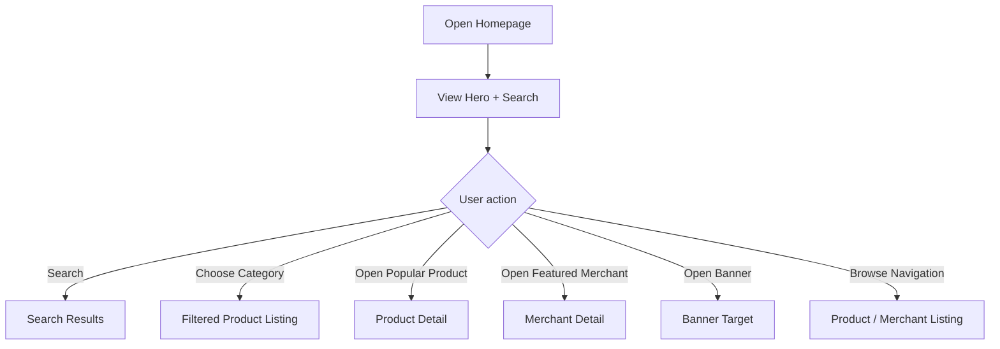

## Homepage Sections

Urutan baseline:

```text
Navbar
Hero + Search
Categories
Popular Products
Featured Merchants
Banner / Promo
About Sungairujing Marketplace
Footer
```

## Expected Behavior

- search langsung mengarah ke hasil pencarian;
- kategori mengarah ke product listing terfilter;
- Produk Populer mengarah ke detail produk;
- Merchant Pilihan mengarah ke halaman merchant;
- banner membuka target yang dikonfigurasi;
- tidak ada statistik palsu.

---

# 6. Visitor Flow — Global Search

## Flow

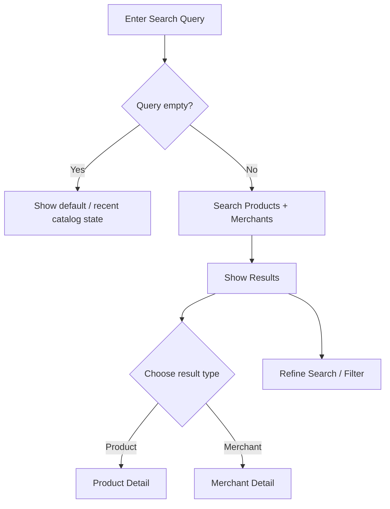

## Rules

Search mencakup:

```text
Products
Merchants
```

Search tidak boleh mencari order, buyer account, atau transaksi karena fitur tersebut tidak tersedia.

---

# 7. Visitor Flow — Browse Product Catalog

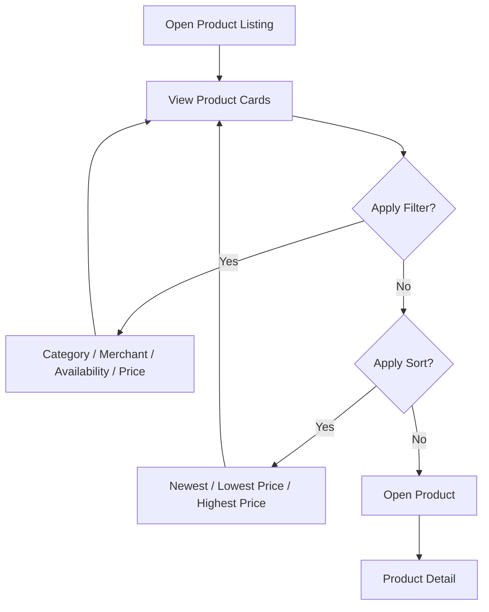

## Product Card Information

```text
Cover Image
Product Name
Price
Merchant Name
Availability
```

Produk `HABIS` tetap boleh terlihat, tetapi statusnya harus jelas.

Produk suspended atau produk milik merchant suspended tidak boleh tampil.

---

# 8. Visitor Flow — Product Detail

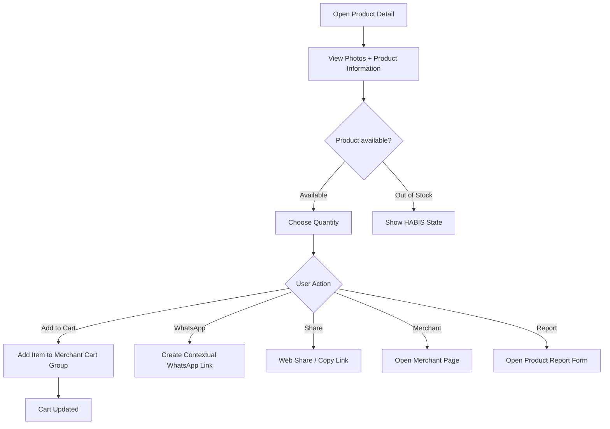

## Product Detail Must Show

- galeri foto;
- nama;
- harga;
- deskripsi;
- kategori;
- availability;
- merchant;
- lokasi merchant;
- quantity;
- Add to Cart;
- WhatsApp CTA;
- Share;
- Report.

## Special States

### Product Habis

```text
Product Detail
→ Show HABIS
→ Do not imply guaranteed stock
```

### Product Suspended

Public direct URL tidak boleh menampilkan produk sebagai produk aktif.

Behavior teknis final ditentukan pada Technical Specification, tetapi UX harus memberi state yang jelas seperti tidak tersedia / tidak ditemukan.

---

# 9. Visitor Flow — Add to Cart

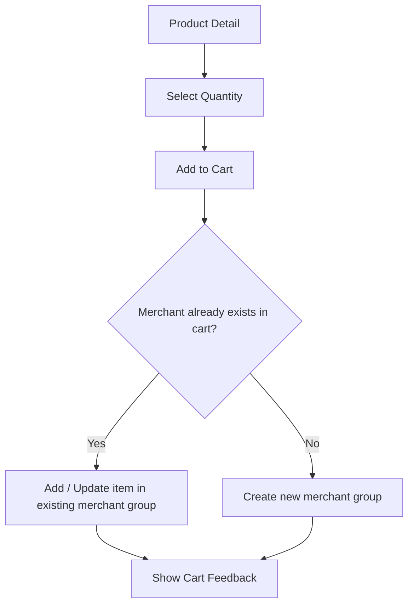

## Rules

- minimum quantity = 1;
- cart tidak membutuhkan akun;
- cart disimpan secara lokal;
- cart dapat berisi beberapa merchant;
- setiap item tetap terkait dengan merchant pemilik produk.

---

# 10. Visitor Flow — Multi-Merchant Cart

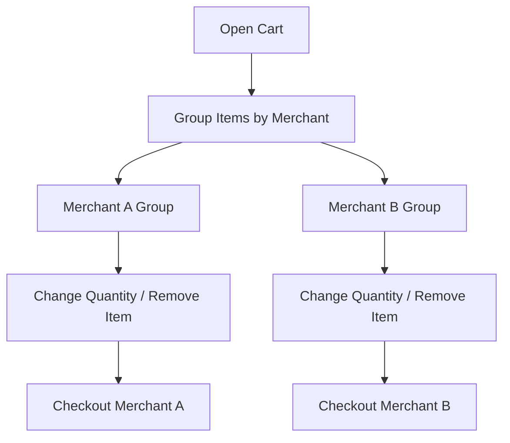

Contoh:

```text
Keranjang

Dapur Bawean
├── Koncok-Koncok ×2
├── Ghule Merah ×1
└── [Checkout Dapur Bawean]

Toko Oleh-Oleh
├── Kerupuk Sangar ×3
└── [Checkout Toko Oleh-Oleh]
```

## Important Rule

Tidak ada:

```text
Checkout All Merchants
```

Satu checkout hanya untuk satu merchant.

---

# 11. Visitor Flow — Cart Validation Before Checkout

Sebelum checkout, sistem perlu memastikan item masih valid.

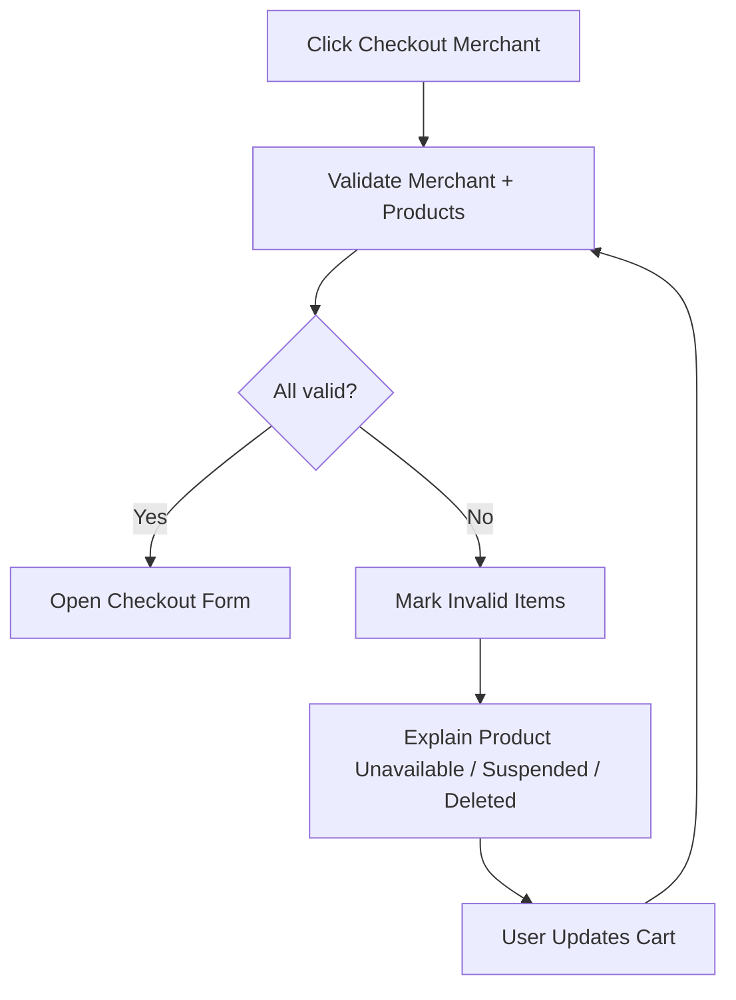

Item dianggap tidak valid jika:

```text
Product deleted
Product suspended
Merchant suspended
```

Produk `HABIS` tidak selalu harus dihapus dari cart, tetapi status harus ditampilkan dan pengguna harus diberi tahu bahwa ketersediaan perlu dikonfirmasi.

---

# 12. Visitor Flow — Checkout per Merchant

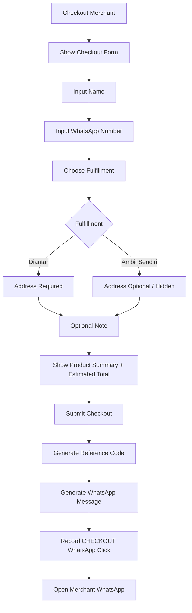

---

# 13. Checkout Form Rules

Required:

```text
Name
WhatsApp Number
Fulfillment Method
```

Conditional:

```text
IF fulfillment = DIANTAR
THEN address required
```

Optional:

```text
Note
```

Fulfillment options:

```text
AMBIL_SENDIRI
DIANTAR
```

---

# 14. Checkout Summary

Checkout summary minimal menampilkan:

```text
Merchant Name
Products
Quantity
Subtotal per Item
Estimated Product Total
Fulfillment Method
Buyer Name
Buyer WhatsApp
Address if delivery
Note if provided
```

Sistem tidak menghitung ongkir.

Copy harus menjelaskan bahwa total merupakan **estimasi harga produk**.

---

# 15. WhatsApp Handoff Flow

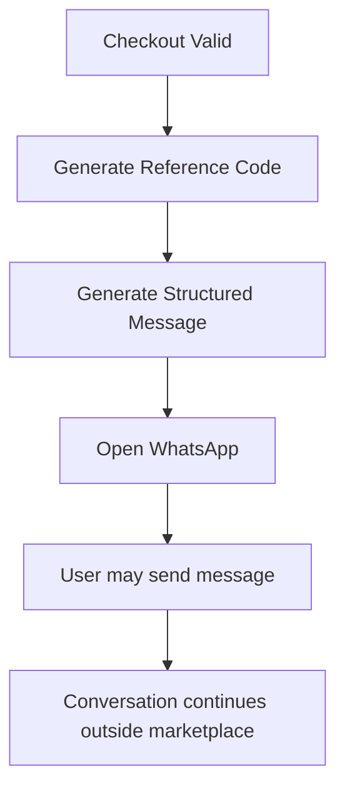

Contoh struktur pesan:

```text
Halo {Nama Merchant}, saya ingin menanyakan pesanan
dari Sungairujing Marketplace.

2x Koncok-Koncok — Rp40.000
1x Kerupuk Sangar — Rp15.000

Total estimasi: Rp55.000

Nama: Dimas
No. WhatsApp: 08xxxxxxxx
Metode: Diantar
Alamat: ...
Catatan: ...
Kode: SRM-XXXX

Mohon konfirmasi ketersediaan dan total pembayarannya.
```

Reference code hanya alat bantu komunikasi, bukan order ID.

---

# 16. Visitor Flow — Direct WhatsApp from Product

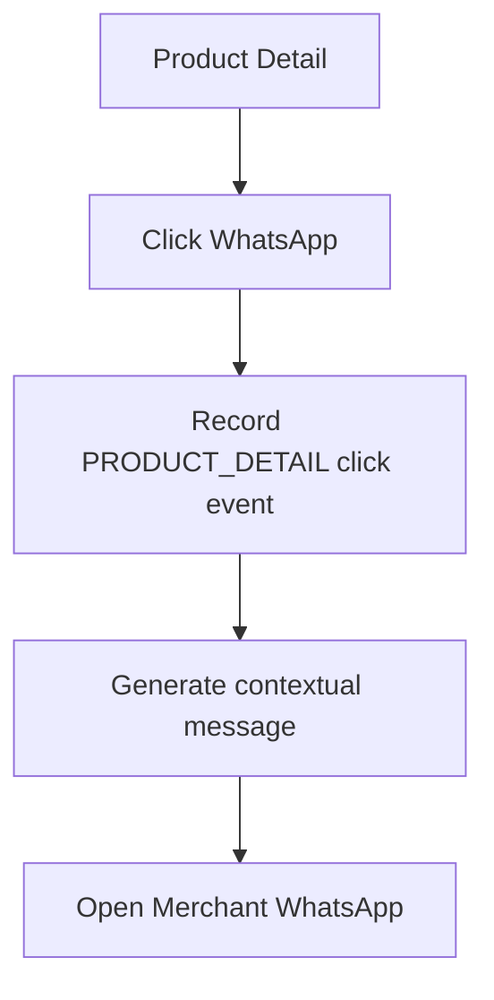

Pesan dapat berisi nama produk agar merchant memahami konteks.

---

# 17. Visitor Flow — Direct WhatsApp from Merchant Page

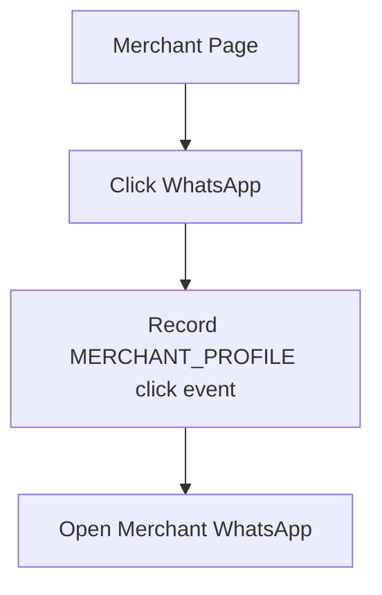

---

# 18. Visitor Flow — Share Product

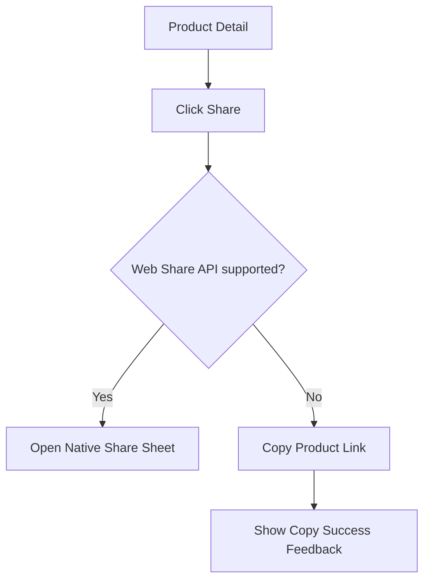

---

# 19. Visitor Flow — Report Product

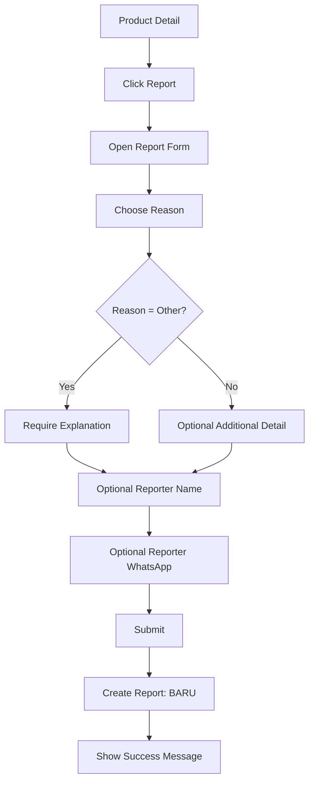

Reasons:

```text
Illegal / prohibited
Dangerous product
Fraud / misleading
Photo-description mismatch
Spam
Other
```

Tidak ada auto-suspension.

---

# 20. Visitor Flow — Report Merchant

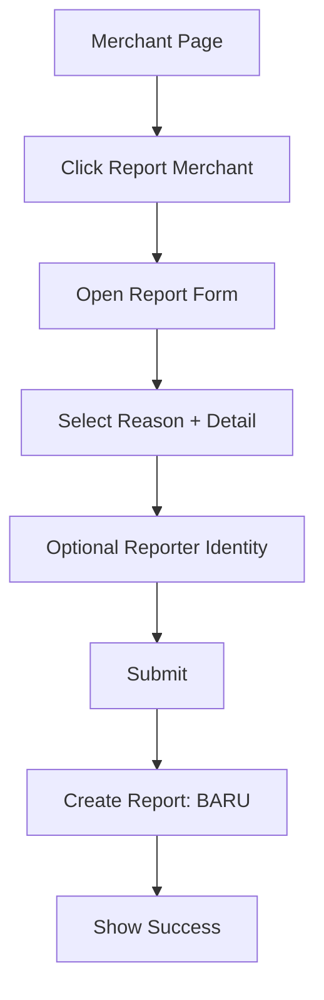

---

# 21. Visitor Flow — Merchant QR

```mermaid
flowchart TD
    A[User Scans Merchant QR] --> B[/merchant/{slug}]
    B --> C{Merchant public?}
    C -->|Yes| D[Open Merchant Public Page]
    C -->|No| E[Show Unavailable State]
```

QR tidak mengarah ke produk.

---

# 22. Merchant Flow — Registration

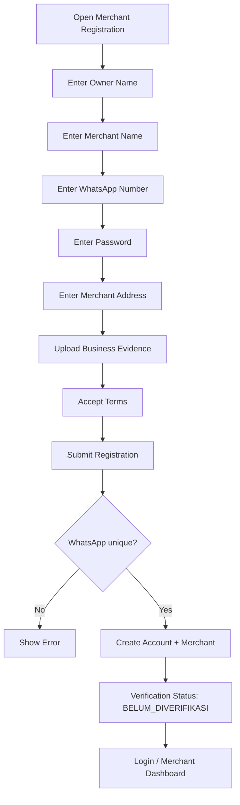

## Registration Rules

- tidak ada OTP pada MVP;
- email tidak wajib;
- nomor WhatsApp harus unik;
- password minimal 8 karakter;
- syarat dan ketentuan wajib disetujui;
- merchant langsung aktif setelah registrasi.

---

# 23. Merchant Flow — Login

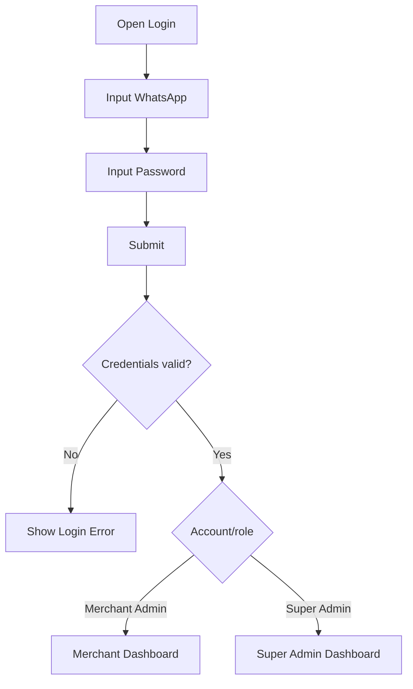

---

# 24. Merchant Flow — Forgot Password

Target flow:

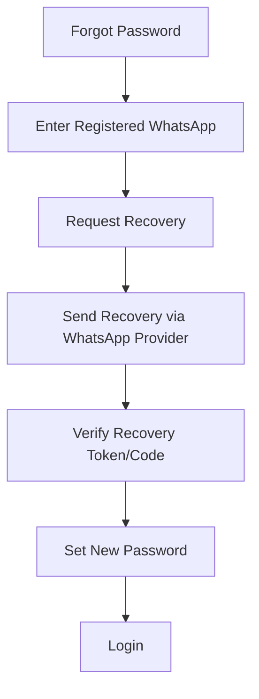

Catatan:

Fitur ini memiliki dependency provider/API WhatsApp.

Jika provider belum tersedia, UI produksi tidak boleh menampilkan recovery seolah-olah sudah berfungsi.

---

# 25. Merchant Dashboard — Main Navigation

```text
Dashboard
├── Overview
├── Produk
│   ├── Semua Produk
│   └── Tambah Produk
├── Profil Merchant
├── Verifikasi
├── Analytics
├── Notifikasi
└── Pengaturan Akun
```

---

# 26. Merchant Flow — Dashboard Overview

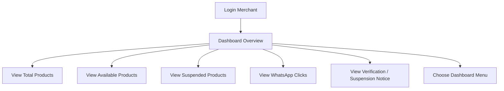

Jika merchant suspended, dashboard tetap dapat dibuka, tetapi state pembekuan harus terlihat jelas.

---

# 27. Merchant Flow — Create Product

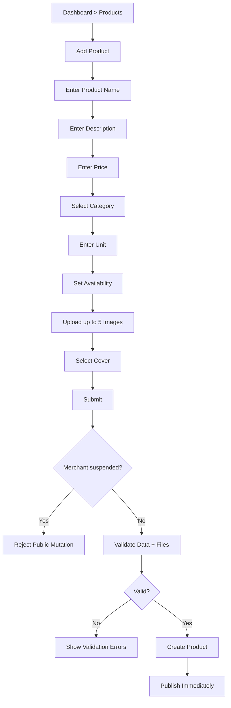

Tidak ada product approval queue.

---

# 28. Merchant Flow — Edit Product

```mermaid
flowchart TD
    A[Products List] --> B[Open Own Product]
    B --> C[Edit]
    C --> D[Update Fields / Images]
    D --> E[Submit]
    E --> F[Server Ownership Check]
    F --> G{Owner valid?}
    G -->|No| H[Reject]
    G -->|Yes| I{Merchant suspended?}
    I -->|Yes| J[Reject Public Mutation]
    I -->|No| K[Save Changes]
```

---

# 29. Merchant Flow — Delete Product

```mermaid
flowchart TD
    A[Products List] --> B[Delete Product]
    B --> C[Show Strong Confirmation]
    C --> D{Confirm?}
    D -->|No| E[Cancel]
    D -->|Yes| F[Server Ownership Check]
    F --> G{Valid owner?}
    G -->|No| H[Reject]
    G -->|Yes| I[Delete according to DB integrity rules]
    I --> J[Return to Product List]
```

---

# 30. Merchant Flow — Suspended Product

```mermaid
flowchart TD
    A[Merchant Products] --> B[Product marked Suspended]
    B --> C[View Moderation Reason]
    C --> D[Merchant may edit data if allowed by technical policy]
    C --> E[Cannot self-unsuspend]
    E --> F[Wait for Super Admin action]
```

Merchant tidak boleh mengaktifkan sendiri produk yang disuspend oleh Super Admin.

---

# 31. Merchant Flow — Manage Profile

```mermaid
flowchart TD
    A[Dashboard > Merchant Profile] --> B[Edit Profile]
    B --> C[Name / Logo / Description]
    C --> D[Address / Opening Hours]
    D --> E[Operational Status]
    E --> F[Save]
    F --> G[Server Ownership Check]
    G --> H{Merchant suspended?}
    H -->|Yes| I[Restrict public-affecting mutation]
    H -->|No| J[Update Profile]
```

Nomor WhatsApp login tidak diubah dari flow ini.

---

# 32. Merchant Flow — Verification

```mermaid
flowchart TD
    A[Dashboard > Verification] --> B[View Current Status]
    B --> C{Status}
    C -->|BELUM_DIVERIFIKASI| D[Upload / Review Evidence]
    C -->|DITOLAK| E[View Rejection Reason]
    C -->|TERVERIFIKASI| F[Show Verified State]
    D --> G[Submit Verification]
    E --> H[Replace / Update Evidence]
    H --> G
    G --> I[Await Super Admin Review]
```

Bukti usaha maksimal 3 file dan tidak boleh publik.

---

# 33. Merchant Flow — Analytics

```mermaid
flowchart TD
    A[Dashboard > Analytics] --> B[Choose Period]
    B --> C{Period}
    C -->|Today| D[Load Today]
    C -->|7 Days| E[Load 7 Days]
    C -->|30 Days| F[Load 30 Days]
    C -->|All Time| G[Load All Time]
    D --> H[Show Product Views + WhatsApp Clicks]
    E --> H
    F --> H
    G --> H
    H --> I[Show Simple Chart]
```

Merchant hanya dapat melihat data merchant miliknya.

---

# 34. Merchant Flow — Notifications

```mermaid
flowchart TD
    A[Dashboard > Notifications] --> B[View Notifications]
    B --> C[Open Notification]
    C --> D{Type}
    D -->|Verification| E[Open Verification]
    D -->|Product Suspended| F[Open Product]
    D -->|Merchant Suspended| G[Open Account / Suspension Info]
```

Notification MVP bersifat internal dashboard.

---

# 35. Merchant Flow — Change Password

```mermaid
flowchart TD
    A[Account Settings] --> B[Change Password]
    B --> C[Enter Old Password]
    C --> D[Enter New Password]
    D --> E[Submit]
    E --> F{Old Password Correct?}
    F -->|No| G[Show Error]
    F -->|Yes| H{New Password >= 8 chars?}
    H -->|No| I[Show Validation Error]
    H -->|Yes| J[Update Password]
```

---

# 36. Merchant Flow — Request WhatsApp Number Change

Nomor login tidak diubah sendiri oleh merchant.

Expected UX:

```text
Account Settings
→ WhatsApp Number
→ Inform merchant that change requires Super Admin
→ Provide instruction/contact path
```

Actual update dilakukan melalui Super Admin.

---

# 37. Suspended Merchant Flow

```mermaid
flowchart TD
    A[Merchant Login] --> B[Dashboard]
    B --> C[Show Suspended Status + Reason]
    C --> D[Allow Read Dashboard]
    C --> E[Allow View Analytics / Notices as permitted]
    C --> F[Block Public-affecting Mutations]
    F --> G[Wait for Super Admin Reactivation]
```

Public result:

```text
Merchant Suspended
→ Merchant unavailable publicly
→ All products hidden
→ Featured placement ignored
```

---

# 38. Super Admin Dashboard — Main Navigation

```text
Dashboard
├── Overview
├── Merchant
├── Verifikasi Merchant
├── Produk
├── Kategori
├── Laporan
├── Banner / Promo
├── Merchant Pilihan
└── Pengaturan
```

---

# 39. Super Admin Flow — Overview

```mermaid
flowchart TD
    A[Super Admin Login] --> B[Overview]
    B --> C[Total Merchants]
    B --> D[Active Merchants]
    B --> E[Suspended Merchants]
    B --> F[Total Products]
    B --> G[Suspended Products]
    B --> H[Total Categories]
    B --> I[Open Management Section]
```

---

# 40. Super Admin Flow — Merchant List

```mermaid
flowchart TD
    A[Merchant Management] --> B[View Merchant List]
    B --> C[Search / Filter]
    C --> D[Open Merchant]
    D --> E{Action}
    E -->|Edit| F[Edit Merchant]
    E -->|Suspend| G[Suspend Flow]
    E -->|Reactivate| H[Reactivate Flow]
    E -->|Delete| I[Permanent Delete Flow]
    E -->|Change WhatsApp| J[Admin Change Login Identifier]
```

---

# 41. Super Admin Flow — Verify Merchant

```mermaid
flowchart TD
    A[Verification Queue] --> B[Open Merchant Submission]
    B --> C[View Merchant Data]
    C --> D[View Business Evidence]
    D --> E{Decision}
    E -->|Approve| F[Set TERVERIFIKASI]
    E -->|Reject| G[Enter Rejection Reason]
    G --> H[Set DITOLAK]
    F --> I[Create Internal Notification]
    H --> I
```

Verification tidak menentukan apakah merchant boleh berjualan.

---

# 42. Super Admin Flow — Suspend Merchant

```mermaid
flowchart TD
    A[Merchant Detail] --> B[Suspend Merchant]
    B --> C[Enter Suspension Reason]
    C --> D[Confirm]
    D --> E[Set Suspended]
    E --> F[Hide Merchant Publicly]
    E --> G[Hide All Merchant Products]
    E --> H[Ignore Featured Placement]
    E --> I[Create Merchant Notification]
```

Tidak ada delete data pada suspension.

---

# 43. Super Admin Flow — Reactivate Merchant

```mermaid
flowchart TD
    A[Suspended Merchant] --> B[Reactivate]
    B --> C[Confirm]
    C --> D[Set Active]
    D --> E[Restore Public Eligibility]
    E --> F[Products become eligible if not individually suspended]
```

---

# 44. Super Admin Flow — Permanent Delete Merchant

```mermaid
flowchart TD
    A[Merchant Detail] --> B[Delete Permanently]
    B --> C[Show Strong Warning]
    C --> D[Require Confirmation]
    D --> E{Confirmed?}
    E -->|No| F[Cancel]
    E -->|Yes| G[Execute Database Deletion Policy]
    G --> H[Remove / Preserve related data per DB rules]
    H --> I[Return to Merchant List]
```

Technical behavior untuk analytics/report/file relation ditentukan pada `DATABASE.md`.

---

# 45. Super Admin Flow — Product Moderation

```mermaid
flowchart TD
    A[Admin Product List] --> B[Open Product]
    B --> C{Action}
    C -->|Suspend| D[Enter Reason]
    D --> E[Confirm Suspension]
    E --> F[Set Product Suspended]
    F --> G[Hide Publicly]
    F --> H[Notify Merchant]
    C -->|Delete| I[Strong Confirmation]
    I --> J[Delete per Database Rules]
```

---

# 46. Super Admin Flow — Reports

```mermaid
flowchart TD
    A[Reports Page] --> B[View BARU Reports]
    B --> C[Open Report]
    C --> D[Set DITINJAU]
    D --> E[Review Target + Detail]
    E --> F{Decision}
    F -->|No Violation| G[Set DITOLAK / SELESAI]
    F -->|Violation| H[Take Moderation Action]
    H --> I[Set SELESAI]
```

Report tidak pernah melakukan auto-suspension.

---

# 47. Super Admin Flow — Category Management

```mermaid
flowchart TD
    A[Categories] --> B{Action}
    B -->|Create| C[Enter Category Data]
    C --> D[Save]
    B -->|Edit| E[Edit Category]
    E --> F[Save]
    B -->|Delete| G[Check Product References]
    G --> H{Safe to delete?}
    H -->|No| I[Use Restrict/Reassign/Disable Rule]
    H -->|Yes| J[Delete]
```

Merchant tidak memiliki akses create category.

---

# 48. Super Admin Flow — Banner Management

```mermaid
flowchart TD
    A[Banner Management] --> B{Action}
    B -->|Create| C[Title + Description + Image]
    C --> D[CTA + Target Link]
    D --> E[Start Date + End Date]
    E --> F[Active / Inactive]
    F --> G[Save]
    B -->|Edit| H[Edit Existing Banner]
    B -->|Delete| I[Delete Banner]
```

Public banner hanya eligible jika active dan berada pada periode tayang yang valid.

---

# 49. Super Admin Flow — Featured Merchants

```mermaid
flowchart TD
    A[Featured Merchants] --> B[View Current Selection]
    B --> C[Add / Remove Merchant]
    C --> D{Count <= 5?}
    D -->|No| E[Reject Additional Selection]
    D -->|Yes| F[Save]
```

Merchant suspended tidak ditampilkan di homepage walaupun masih tercatat sebagai featured.

---

# 50. Super Admin Flow — Change Merchant WhatsApp Number

```mermaid
flowchart TD
    A[Merchant Detail] --> B[Change WhatsApp Number]
    B --> C[Enter New Number]
    C --> D{Unique?}
    D -->|No| E[Show Error]
    D -->|Yes| F[Confirm Sensitive Action]
    F --> G[Update Login Identifier + Merchant Contact as defined]
```

Technical Specification harus memastikan sinkronisasi nomor login dan nomor kontak sesuai model data final.

---

# 51. Product View Analytics Flow

```mermaid
flowchart TD
    A[Visitor Opens Product Detail] --> B[Check Browser/Product 24h Marker]
    B --> C{Already counted?}
    C -->|Yes| D[Do Not Increment Count]
    C -->|No| E[Record Counted View]
    E --> F[Save 24h Dedupe Marker]
```

Metric ini digunakan untuk Produk Populer.

---

# 52. WhatsApp Analytics Flow

```mermaid
flowchart TD
    A[User Clicks WhatsApp CTA] --> B[Determine Source]
    B --> C{Source}
    C -->|Product| D[PRODUCT_DETAIL]
    C -->|Merchant| E[MERCHANT_PROFILE]
    C -->|Checkout| F[CHECKOUT]
    D --> G[Record Click Event]
    E --> G
    F --> G
    G --> H[Open WhatsApp]
```

Event berarti CTA dijalankan, bukan pesan terkirim.

---

# 53. Popular Product Flow

```mermaid
flowchart TD
    A[Homepage Request] --> B[Fetch Eligible Products]
    B --> C[Exclude Suspended Product]
    C --> D[Exclude Suspended Merchant]
    D --> E[Rank by Counted Product Views]
    E --> F[Take Top 8]
    F --> G[Render Produk Populer]
```

---

# 54. Featured Merchant Public Flow

```mermaid
flowchart TD
    A[Homepage Request] --> B[Fetch Featured Merchants]
    B --> C[Exclude Suspended Merchants]
    C --> D[Limit 5]
    D --> E[Render Merchant Pilihan]
```

Verification tidak harus menjadi syarat featured kecuali kemudian diputuskan pada requirement baru.

---

# 55. Banner Public Flow

```mermaid
flowchart TD
    A[Homepage Request] --> B[Fetch Banner]
    B --> C{Active?}
    C -->|No| D[Do Not Render]
    C -->|Yes| E{Within Date Range?}
    E -->|No| D
    E -->|Yes| F[Render Banner]
```

---

# 56. Error and Empty State Flows

## Search Empty

```text
Search
→ No matching result
→ Show clear empty state
→ Offer reset / browse categories
```

## No Products in Category

```text
Category
→ No eligible products
→ Show empty state
→ Link back to all products
```

## Merchant Has No Products

```text
Merchant Page
→ Merchant active
→ Product list empty
→ Show "Belum ada produk"
```

## Cart Empty

```text
Cart
→ No item
→ Show "Keranjang masih kosong"
→ CTA to browse products
```

## Suspended / Deleted Product

```text
Direct Product URL
→ Product not publicly eligible
→ Show unavailable/not-found state
→ CTA back to catalog
```

---

# 57. Authorization Flow

Protected merchant action:

```mermaid
flowchart TD
    A[Request] --> B{Authenticated?}
    B -->|No| C[Reject / Redirect Login]
    B -->|Yes| D{Role valid?}
    D -->|No| E[Reject 403]
    D -->|Yes| F{Resource belongs to merchant?}
    F -->|No| E
    F -->|Yes| G{Merchant suspended?}
    G -->|Yes| H[Allow/Block based on action type]
    G -->|No| I[Execute Action]
```

Protected Super Admin action:

```mermaid
flowchart TD
    A[Admin Request] --> B{Authenticated?}
    B -->|No| C[Reject]
    B -->|Yes| D{SUPER_ADMIN?}
    D -->|No| E[Reject 403]
    D -->|Yes| F[Execute Admin Action]
```

---

# 58. Route-Level User Flow Baseline

Public:

```text
/
├── /products
├── /products/{slug}
├── /merchants
├── /merchant/{slug}
├── /cart
├── /checkout/{merchant}
├── /login
└── /register
```

Merchant dashboard:

```text
/dashboard
├── /dashboard/products
├── /dashboard/products/new
├── /dashboard/products/{id}/edit
├── /dashboard/profile
├── /dashboard/verification
├── /dashboard/analytics
├── /dashboard/notifications
└── /dashboard/account
```

Super Admin:

```text
/admin
├── /admin/merchants
├── /admin/merchants/{id}
├── /admin/verifications
├── /admin/products
├── /admin/categories
├── /admin/reports
├── /admin/banners
├── /admin/featured-merchants
└── /admin/settings
```

Final route naming dapat berubah pada Technical Specification selama user flow tetap sama.

---

# 59. Mobile Navigation Flow

Karena mobile-first, primary navigation harus mudah dijangkau.

Baseline public navigation:

```text
Home
Products
Merchants
Cart
```

Account/dashboard CTA ditampilkan terpisah sesuai authentication state.

Merchant dashboard mobile navigation harus memprioritaskan:

```text
Overview
Products
Analytics
More
```

Detail final ditentukan pada Design System/Wireframe.

---

# 60. State Matrix

| State | Public Visibility | Merchant Login | Merchant Edit Public Content |
|---|---:|---:|---:|
| Merchant active + unverified | Yes | Yes | Yes |
| Merchant active + verified | Yes | Yes | Yes |
| Merchant verification rejected | Yes | Yes | Yes |
| Merchant suspended | No | Yes | No |
| Product available | Yes | — | Yes |
| Product out of stock | Yes | — | Yes |
| Product suspended | No | — | Cannot self-unsuspend |
| Product deleted | No | — | No |

---

# 61. Primary Success Paths

## Buyer Success Path

```text
Homepage
→ Search Product
→ Product Detail
→ Add to Cart
→ Checkout Merchant
→ Fill Data
→ Open WhatsApp
```

## Merchant Success Path

```text
Register
→ Login
→ Complete Profile
→ Add Product
→ Product Published
→ View Analytics
```

## Super Admin Success Path

```text
Login
→ Review Verification / Report
→ Take Administrative Action
→ Marketplace State Updated
```

---

# 62. Critical Failure Paths

## Merchant Cross-Tenant Access

```text
Merchant A
→ Attempts Product B URL/ID
→ Server Ownership Check
→ Reject 403
```

## Suspended Merchant Mutation

```text
Suspended Merchant
→ Attempts Add/Edit Public Product
→ Server Suspension Check
→ Reject
```

## Invalid Checkout

```text
Cart Product
→ Product deleted/suspended
→ Validation fails
→ Do not open WhatsApp with invalid item
```

## Duplicate WhatsApp Registration

```text
Register
→ Number already exists
→ Reject registration
→ Show clear validation
```

---

# 63. UX Feedback Requirements

Setiap aksi penting harus memberi feedback.

Contoh:

```text
Add to Cart
→ "Produk ditambahkan ke keranjang"

Copy Link
→ "Tautan berhasil disalin"

Submit Report
→ "Laporan berhasil dikirim"

Save Product
→ "Produk berhasil disimpan"

Delete Product
→ "Produk berhasil dihapus"
```

Error harus menjelaskan tindakan yang bisa dilakukan pengguna, bukan hanya menampilkan error teknis.

---

# 64. Confirmation Requirements

Confirmation wajib untuk destructive/sensitive action:

```text
Delete Product
Suspend Product
Suspend Merchant
Delete Merchant Permanently
Change Merchant WhatsApp Number
```

Permanent delete membutuhkan warning yang lebih kuat daripada suspend.

---

# 65. User Flow Constraints

User flow tidak boleh memperkenalkan:

```text
Buyer Login
Buyer Registration
Wishlist
Rating
Review
Payment Gateway
Shipping API
Order History
Order Status
Sales Dashboard
Product Approval Queue
Product Variant Selector
Numeric Inventory
```

kecuali requirement diperbarui.

---

# 66. Flow-to-Document Handoff

Dokumen berikutnya harus menggunakan user flow ini sebagai dasar.

## DATABASE.md

Harus mendukung:

- user/account;
- merchant;
- merchant membership/future multi-admin readiness;
- verification;
- business evidence;
- product;
- product image;
- category;
- analytics;
- reports;
- banner;
- featured merchant;
- notifications.

Tidak membutuhkan entity order.

## DESIGN-SYSTEM.md

Harus mendukung seluruh state:

```text
Available
Out of Stock
Verified
Unverified
Rejected Verification
Suspended Product
Suspended Merchant
Empty
Loading
Error
Success
```

## TECHNICAL-SPEC.md

Harus menentukan:

- auth/session;
- route protection;
- ownership validation;
- upload strategy;
- private evidence access;
- product view dedupe;
- WhatsApp analytics;
- cart persistence;
- QR generation;
- PWA;
- hosting;
- WhatsApp recovery provider.

---

# 67. Final Flow Checklist

Sebelum user flow dianggap terimplementasi:

### Visitor
- homepage dapat dinavigasi;
- search berjalan;
- filter/sort berjalan;
- detail produk tersedia;
- detail merchant tersedia;
- cart multi-merchant berjalan;
- checkout hanya per merchant;
- WhatsApp message benar;
- report berjalan;
- share berjalan.

### Merchant
- registrasi berjalan;
- login berjalan;
- product CRUD berjalan;
- ownership aman;
- profile management berjalan;
- verification flow berjalan;
- analytics berjalan;
- suspension state benar.

### Super Admin
- merchant management berjalan;
- verification berjalan;
- product moderation berjalan;
- report handling berjalan;
- category management berjalan;
- banner berjalan;
- featured merchant berjalan.

### Security
- cross-merchant access ditolak;
- private business evidence terlindungi;
- suspended merchant restrictions berlaku;
- admin-only actions terlindungi.

---

# 68. Status

**USER-FLOW.md v1.0 — APPROVED BASELINE**

Tahap berikutnya:

```text
DATABASE.md
→ DESIGN-SYSTEM.md
→ TECHNICAL-SPEC.md
→ IMPLEMENTATION-PLAN.md
→ AGENTS.md
→ Development with Codex
```
